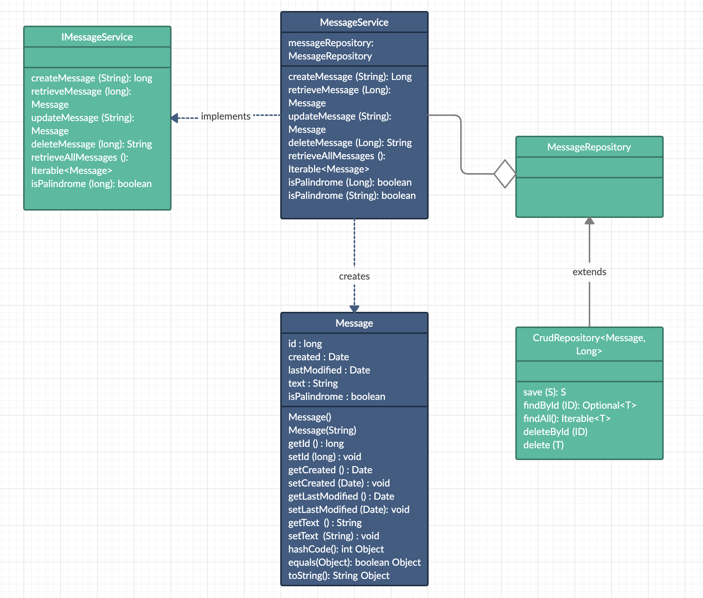

# Messages-Service-Spring-Boot-REST-API

### Project Details
This application manages messages and provides details about them. Specifically, users may find out whether a given message is a palindrome or not. The application supports the following operations:
* Create, retrieve, update, and delete a message.
* Retrieve a list of all messages.

### Continuous Integration
master 

### Architecture
This application was build in Java with the use of the Spring Boot framework following a RESTful design pattern. It can be broken down into three distinct layers; the model, the controller and the service. The application is connected to a MySQL database, using Spring Data JPA to access the database.

The model(s) of the application are organised under the model package.

The MessageRepository class is an extension of the CrudRepository interface helping the service layer to persist and retrieve the data from MySQL. The CrudRepository implements basic CRUD operations, including count, delete, deleteById, save, saveAll, findById, and findAll.

The service layer is defined under the service package.

The controller layer interacts with the service layer to get a job done whenever it receives a request from the api layer. It binds everything together right from the moment a request is intercepted till the response is prepared and sent back. The controller layer is present in the controller package,

#### Libraries/Tools Used
The following libraries were used during the development of this application:
* Spring Boot : Server side framework
* Docker : Containerising framework
* MySQL : SQL database
* Swagger : API documentation

##### Class Diagram

##### REST API
**CREATE MESSAGE**

*POST /messages/create*
- Path Variable(s): NA
- Request Body: The message text. 
* Return: The id of the message if it's successfully created.

**RETRIEVE MESSAGE**

*GET /messages/{messageId}*
- Path Variable(s): The id of the message the user would like to retrieve.
- Request Body: NA
* Return: The message if found, else, a MessageNotFoundException is thrown.

**UPDATE MESSAGE**

*PUT /messages/update/{messageId}*
- Path Variable(s): The id of the message the user would like to update.
- Request Body: The updated message text.
* Return: The updated version of the message (with the new text, new last modified time and date, etc.)

**DELETE MESSAGE**

*DELETE /messages/delete/{messageId}*
- Path Variable(s): The id of the message the user would like to delete.
- Request Body: NA
* Return Value(s): A message indicating whether the message was successfully deleted or not.

**RETRIEVE ALL MESSAGES**

*GET /messages/all*
- Path Variable(s): NA
- Request Body: NA
* Return Value(s): A list of all the messages stored in the database. 

**CHECK MESSAGE IS A PALINDROME**

*GET /messages/check-palindrome/{messageId}*
- Path Variable(s): The id of the message the user would like to check.
- Request Body: NA
* Return Value(s): A boolean representing whether or not the message's text is a palindrome. 

### Running this application
#### build
Build the application by running `mvn clean install`. 

#### running locally
To run the app from a terminal window you can you the java -jar command.
> java -jar target/palindrome-message-service-0.0.1-SNAPSHOT.jar

You can also use Maven plugin to run the app. Use the below example to run your Spring Boot app with Maven plugin :
> mvn spring-boot:run

A local deployment of the application can be found at http://localhost:8080/.

#### Deploying and running with docker
Two seperate docker compose files have been defined for this project. The mySQL database configurations are defined in the docker-compose.yaml and the service's docker deployment is defined in the docker-compose-palindrome.yaml file. Two seperate files were used so that the database and the application may run independently from each other in isolated environments. Use the first command in order to get the database up and running and then run the second command to deploy the palindrome message management application. 

$ docker-compose up -f docker-compose.yaml

$ docker-compose up -f docker-compose-palindrome.yaml

#### API Documentation

A swagger interface is also available to execute the HTTP endpoints. Use the following deployment http://localhost:8080/swagger-ui.html.

### Future improvements
* This application could benefit from the hidding of the primary key of the database by creating some intermittant layer which generates a unique message id for the users.
* As well, in future implementations, users could benefit from a bulk adding functionality where they could create more than one message at a time.
* Finally, users could also greatly benefit from some sort of querying functionality where they could search for message with certains characteristics (e.g. creation date, modification date, etc.)
